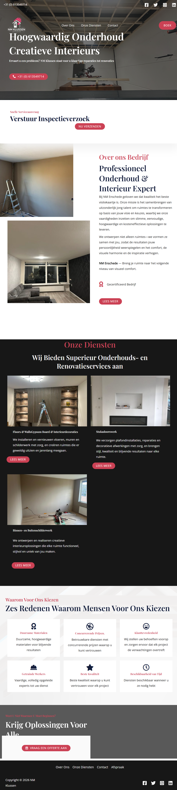
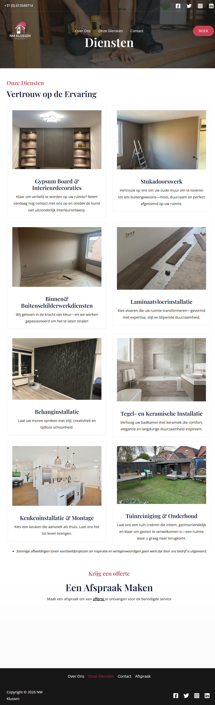
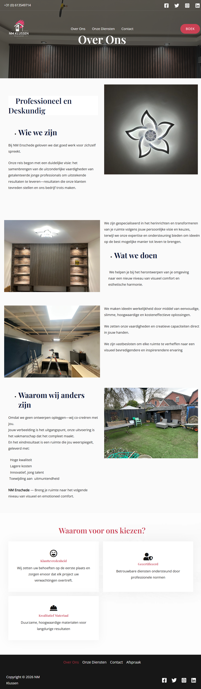
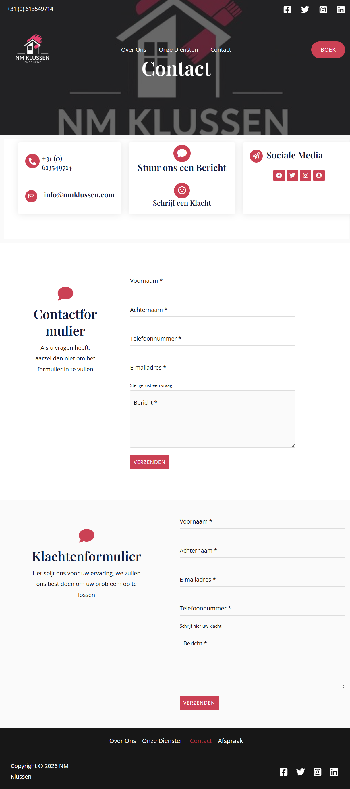

# # 🛠️ NM Klussen — Website Case Study

A professional business website built for **NM Klussen**, a handyman and maintenance service company based in the Netherlands.

This project focuses on delivering a **high-converting, trustworthy, and user-friendly website** using WordPress and a carefully selected set of tools and plugins.

---

## 🌐 Live Website

👉 https://nmklussen.com

---

## 🎯 Project Overview

**Goal:**
Create a professional online presence that clearly communicates services, builds trust, and converts visitors into customers.

**My Role:**
Full website creator — responsible for setup, design, structure, optimization, and deployment.

**Platform & Hosting:**

* WordPress (CMS)
* SiteGround (Hosting)

---

## 🚧 The Challenge

The business needed a website that:

* Clearly explains services to a broad audience
* Builds trust quickly through design and content
* Works flawlessly on mobile devices
* Encourages users to make contact

The challenge was to combine **simplicity, performance, and professionalism**.

---

## 💡 The Solution

I built a structured and responsive website using **Elementor** and supporting plugins to enhance functionality, performance, and SEO.

The approach focused on:

* Clean layout and strong visual hierarchy
* Strategic use of images to build credibility
* Optimized user journey (from landing → contact)
* Integration of analytics and SEO tools for growth

---

## 🧠 Skills Demonstrated

### 💻 Technical

* WordPress development & configuration
* Website deployment via SiteGround
* Plugin ecosystem integration
* Page builder systems (Elementor + addons)
* Form creation and handling
* SEO setup and optimization
* Analytics integration (Google tools)
* Performance and structure optimization

### 🎨 Design

* UI/UX design principles
* Responsive (mobile-first) layout design
* Visual hierarchy and spacing
* Clean and modern interface creation

### 📈 Business Thinking

* Conversion-focused design
* Service-based website architecture
* Lead generation optimization
* Trust-building through content and visuals

---

## 🧩 Key Tools & Plugins

### 🎨 Design & Layout

* **Elementor** → Core page builder for custom layouts and responsive design
* **Ultimate Addons for Elementor (UAE)** → Extended design components and advanced UI elements
* **Spectra** → Additional Gutenberg blocks for flexible content structuring

---

### 📞 Forms & User Interaction

* **Forminator** → Creation of contact forms for lead generation

---

### 🖼️ Media & Portfolio

* **Envira Gallery** → Organized image galleries to showcase completed projects and build trust

---

### 📊 Analytics & Tracking

* **Site Kit by Google** → Integration with Google services (Search Console, Analytics, etc.)
* **Google Analytics for WordPress (MonsterInsights)** → User behavior tracking and insights

---

### 🔍 SEO & Optimization

* **SureRank SEO** → SEO optimization and ranking improvements
* **Yoast Duplicate Post** → Efficient content duplication for consistent page creation

---

### ⚙️ Site Management & Setup

* **SiteGround Central** → Site management and initial setup tools
* **WordPress Importer** → Content import and migration

---

## 🗂️ Website Breakdown

### 🏠 Home Page

**Purpose:** First impression & main conversion entry

* Introduces the business clearly
* Highlights key services and strengths
* Guides users toward contacting

**Focus:** Clarity, trust, and direction

---

### 🧰 Services Page

**Purpose:** Present all services in a structured way and Provide detailed service information

* Easy-to-scan layout
* Clear descriptions of offerings
* Explains what each service includes
* Helps users understand expectations

**Focus:** Simplicity and usability, Transparency and confidence

---

### ℹ️ About Page 

**Purpose:** Build trust and credibility

* Shares background and identity of the business

**Focus:** Authenticity

---

### 📞 Contact Page

**Purpose:** Convert visitors into leads

* Built with Forminator
* Simple and accessible contact flow

**Focus:** Low friction and usability

---

## ⚙️ Tech Stack

* WordPress (CMS)
* Elementor + Addons
* Envira Gallery
* Forminator
* Google Site Kit & MonsterInsights
* SureRank SEO
* HTML5 / CSS3 (custom adjustments)
* SiteGround hosting

---

## 🚀 Performance & Optimization

* Optimized hosting via SiteGround
* Structured and lightweight page design
* Mobile-first responsiveness
* Integrated analytics for performance tracking
* SEO tools configured for visibility

---

## 📊 Results & Impact

* Established a strong and professional online presence
* Improved user trust through visual portfolio
* Clear service communication
* Data tracking enabled for future growth

---

## 🔮 Future Improvements

* Advanced SEO strategy
* Multilingual support (Dutch / English)
* Performance fine-tuning
* Online booking or quote system

---

### 🖼️ Portfolio / Gallery

**Purpose:** Showcase completed work

* Uses Envira Gallery for clean presentation
* Strengthens credibility through real examples

**Focus:** Visual trust-building

---

## 🙌 Final Note

This project demonstrates the ability to combine **WordPress tools, design thinking, and business strategy** to deliver a real-world website that is both functional and effective.

The focus was not just on building a website, but on creating a platform that supports business growth.

---
